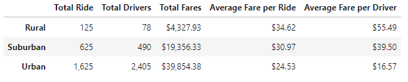
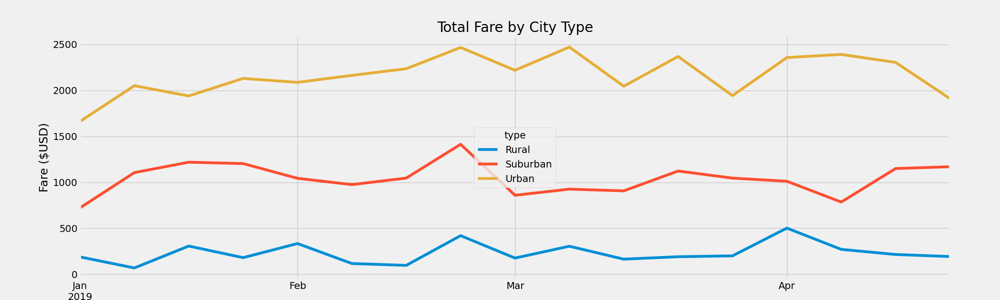

# PyBer_Analysis

## Overview
The purpose of our analysis was to create a summary DataFrame of the ride-sharing data by city type and create a visual that shows the total weekly fare for each city type. This was done to demonstrate how the data differs by city type and how these differences can be used by decision-makers at PyBer. 

## Results
Based on both analyis, we found many results that portrayed the differences in city types. For example, from the summary DataFrame below we can see how in rural cities there are much less total rides and total drivers. From this, the average fare is much higher as there is less of a supply of rides in that area. For urban cities it is the opposite. There are more than 1,500 total rides and 2,300 total drivers in comparison to the rural area and its average fares are much lower. 

From our analysis on the total weekly fare for each city type, it is interesting to see from our line chart below how the fares peak for all three city types near the end of March. This is something worth looking into for Pyber! Apart from knowing that the fares are different for each city from our data frame, it is demonstrated much clearly in our graph. This continues to show the huge difference between fares of rural and urban cities. 

## Summary
Given the results, I have three business recomendations to the CEO for addressing any disparities among the city types. I recommend we send more drivers or allocate drivers from urban to rural areas to increase the amount of activity and decrease the average fare. I also believe we should identify why there were peaks and drops in fares in certain months. This is to regulate the fare for all cities to operate the same. Finally, find why there is a surplus of drivers in urban cities that is exceeding the total amount of rides which did not occur for any other area.
